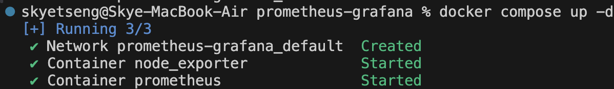
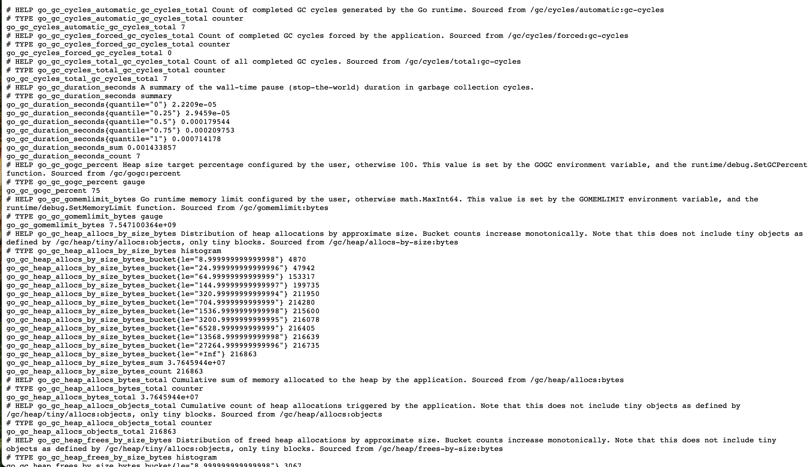
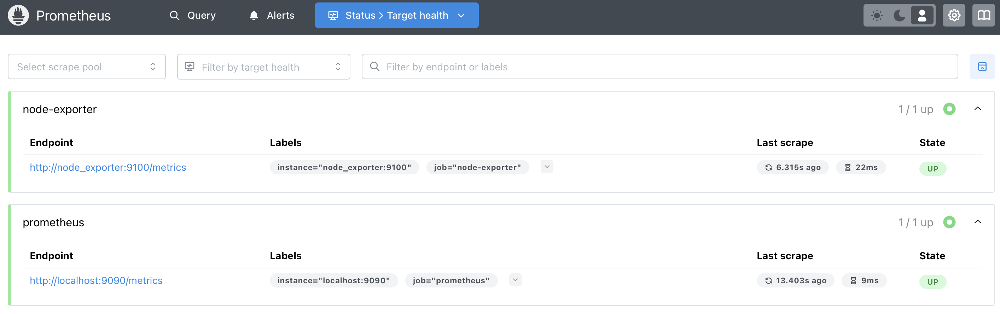
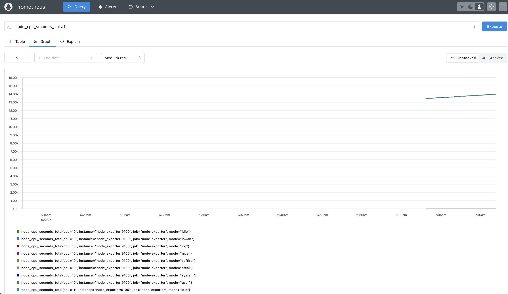

# Send Prometheues Metrics to Grafana Cloud


(Image source：https://devopscube.com/prometheus-architecture/)

The **Prometheus server** is the brain of the metric-based monitoring system. The main job of the server is to collect the metrics from various targets using pull model.

Prometheus uses two methods to scrape metrics from the targets.

**Static configs** : When the targets have a static IP or DNS endpoint, we can use those endpoints as targets.
- **Exporters** : Exporters are like agents that run on the targets. It converts metrics from specific system to format that prometheus understands.By default these converted metrics are exposed by the exporter on /metrics path(HTTPS endpoint) of the target.
</br> ex:
    ```
    scrape_configs:
    - job_name: 'node-exporter'
        static_configs:
        - targets: ['node-exporter1:9100', 'node-exporter2:9100']

    - job_name: 'blackbox-exporter'
        static_configs:
        - targets: ['blackbox-exporter1:9115', 'blackbox-exporter2:9115']
        metrics_path: /probe

    - job_name: 'snmp-exporter'
        static_configs:
        - targets: ['snmp-exporter1:9116', 'snmp-exporter2:9116']
        metrics_path: /snmp
    ```

- **Pushgateway** : The batch jobs can push the metrics to the pushgateway using HTTP API. Then Pushgateway exposes those metrics on /metrics endpoint. Then prometheus scrapes those metrics from the Pushgateway.
</br> ex:
    ```
    scrape_configs:
    - job_name: "pushgateway"
            honor_labels: true
            static_configs:
            - targets: [pushgateway.monitoring.svc:9091]
    ```

**Sevice Discovery**: In most autoscaling systems and distributed systems like Kubernetes, the target will not have a static endpoint. In this case, that target endpoints are discovered using prometheus service discovery and targets are added automatically to the prometheus configuration.
</br> ex:
`kubernetes_sd_configs`
```
scrape_configs:
    - job_name: 'kubernetes-apiservers'
        kubernetes_sd_configs:
        - role: endpoints
        scheme: https
        tls_config:
        ca_file: /var/run/secrets/kubernetes.io/serviceaccount/ca.crt
        bearer_token_file: /var/run/secrets/kubernetes.io/serviceaccount/token
        relabel_configs:
        - source_labels: [__meta_kubernetes_namespace, __meta_kubernetes_service_name, __meta_kubernetes_endpoint_port_name]
        action: keep
        regex: default;kubernetes;https
```

Use a hosted Grafana instance at Grafana Cloud(free tier)

Description
--
To implement sending local monitoring data from Prometheus to Grafana


Getting Started
--

### Directory structure
```
.
├── README.md
├── docker-compose.yaml
└── prometheus.yaml
```

docker-compose.yaml : configure node-exporter、prometheus Docker application
prometheus.yaml :  configuration file used by Prometheus

### Run/Test
- Run Docker Compose
    ```
    docker compose up -d
    ```

    

#### Node-Exporter
- Visit `http://localhost:9100/metrics` to check node-exporter metrics
    

#### Prometheus
- Next, let's visit `http://localhost:9090/targets` to check if our Prometheus is correctly configured and has detected the targets we set

    

    We can first use Prometheus built-in graph to check by visiting `http://localhost:9090/graph`

    

#### Grafana

- Write this code into `prometheus.yaml` to be used for writing into Grafana
    ```
    remote_write:
    - url: https://prometheus-prod-49-prod-ap-northeast-0.grafana.net/api/prom/push
    basic_auth:
        username: 2226731
        password: 
    ```
- Login Grafana Cloud : `https://a0919111125.grafana.net` 

- You can import dashboards made by others in the [Grafana Labs dashboard](https://grafana.com/grafana/dashboards/) and
I imported [Node Exporter Full](https://grafana.com/grafana/dashboards/1860-node-exporter-full/) dashboard like below.


Acknowledgments
--
- [Get started with Grafana and Prometheus](https://grafana.com/docs/grafana/latest/getting-started/get-started-grafana-prometheus/)

- [880831ian/Prometheus-Grafana-Docker](https://github.com/880831ian/Prometheus-Grafana-Docker?tab=readme-ov-file)

- [Learn Prometheus Architecture: A Complete Guide](https://devopscube.com/prometheus-architecture/)